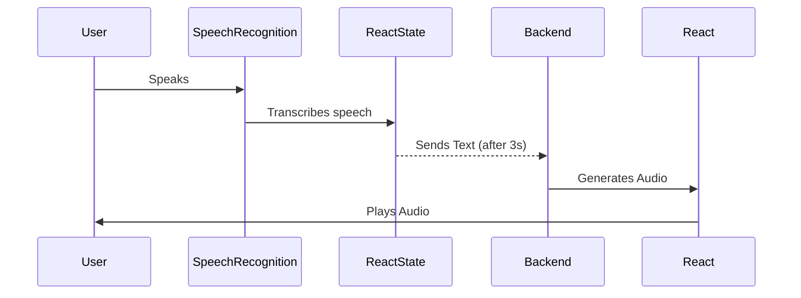

# Voice Chat Web Application

## Overview
This is a React-based web application that captures user voice input, converts it into text, and sends it to a backend for processing. The backend generates an audio response, which is then played back to the user. The application leverages the Web Speech API for speech recognition and Axios for HTTP requests.

## Features
- **Voice Recognition**: Captures user speech and transcribes it into text.
- **Debounced Request**: Ensures that the request is sent only after the user stops speaking for a short period.
- **Backend Integration**: Sends the transcribed text to a backend endpoint (`/chat`).
- **Audio Playback**: Plays the response audio received from the backend.

## Technologies Used
- **React**: Frontend framework
- **Web Speech API**: Handles speech recognition
- **Axios**: Manages HTTP requests
- **HTML5 Audio API**: Plays the audio response

## Installation

### Prerequisites
- Node.js and npm installed
- A backend service running at `http://localhost:3000/chat`

### Steps to Run
1. Clone the repository:
   ```sh
   git clone <repository-url>
   cd <project-folder>
   ```
2. Install dependencies:
   ```sh
   npm install
   ```
3. Start the application:
   ```sh
   npm start
   ```

## Usage
1. Click the **"🎤 Press to Speak"** button.
2. Speak into your microphone; the app will transcribe your speech in real time.
3. After 3 seconds of inactivity, the text will be sent to the backend.
4. The backend will return an audio response, which will be played automatically.

## Sequence Diagram


## Code Explanation
### `useEffect` for Debounce
This ensures that the request is sent **only after 3 seconds of inactivity**:
```tsx
useEffect(() => {
  if (keyword && keyword.length > 0) {
    const debounceTimer = setTimeout(async () => {
      try {
        const response = await axios.post("http://localhost:3000/chat", { prompt: keyword });
        setResponse(response?.data?.audio);
      } catch (error) {
        console.error("❌ Error sending the request:", error);
      }
    }, 3000);
    return () => clearTimeout(debounceTimer);
  }
}, [keyword]);
```

### Speech Recognition
The Web Speech API listens for user input and updates the `keyword` state with transcribed text:
```tsx
const startListening = () => {
  const SpeechRecognition =
    (window as any).SpeechRecognition || (window as any).webkitSpeechRecognition;

  if (!SpeechRecognition) {
    alert("❌ Your browser does not support speech recognition.");
    return;
  }

  const recognition = new SpeechRecognition();
  recognition.lang = "es-ES";
  recognition.interimResults = true;
  recognition.continuous = false;

  recognition.onresult = (event: any) => {
    const transcript = event.results[0][0].transcript;
    setKeyword(transcript);
  };

  recognition.onerror = (event: any) => {
    console.error("❌ Speech recognition error:", event);
    setIsListening(false);
  };

  recognition.onend = () => {
    setIsListening(false);
  };

  recognition.start();
};
```

## Future Improvements
- Support for multiple languages.
- Improve error handling.
- Implement real-time streaming responses.

## License
This project is licensed under the MIT License.

